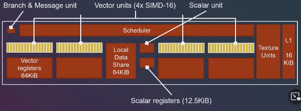

# Compute Shaders

***This is a very brief collection of thoughts***

## GPU Hardware Model

A GPU core is called a compute unit. This is where we do operations on our data. GPUs have a lot of CUs (eg RTX 2080ti has 68 “Streaming Multiprocessors”). 

In the compute unit we always operate on data in parallel using very wide SIMD units (32 or 64 wide depending on device).  (eg RTX 2080ti has 2 32 wide executors in a CU).

A Diagram:

 

Inside a SIMD executor a single item/cell is called a thread/lane/cuda core.

 

So a thread is a single item that the GPU can do operations on. Don't confuse it with the cpu threads. A group of threads may also be called a wavefront/wave.

A very important detail is that because executions run 32 or 64 at a  time, they cant do branching on a per-element basis. If you have a  branch that is taken 50% of the time, the GPU will have to execute those 2 branches one after another.

## GPU Compute Model

First of all, in the shader we specify the size of out local workgroup, meaning the number (X\*Y\*Z ) of individual elements that this particular shaders is going to operate on:

```c++
 layout(local_size_x = X, local_size_y = Y, local_size_z = Z) in;
```

A workgroup can map to one of those cores, but that’s for the driver to  decide. Most of the time people choose a workgroup size that is a  multiple of 64, and not very big, as a bigger workgroup size has to  reserve more memory, and could be split within multiple cores. The  workgroup can be multidimensional. It’s very common to have things like  16x16 workgroup size when doing postprocess filters or other similar  rendering shaders.

Within the compute shader itself, you can find what “element” you are by using

```c++
gl_GlobalInvocationID.x;
```

This will be unique per shader invocation and is what you will use for almost everything. You can also access `gl_LocalInvocationID`, which gives you what index you have within the workgroup, and `gl_WorkGroupID` to know what workgroup is being executed.

Now, using the graphics API of our choice we **Dispatch** work to the gpu. We do that by calling for example:

```c++
void vkCmdDispatch(
    VkCommandBuffer                             commandBuffer,
    uint32_t                                    groupCountX,
    uint32_t                                    groupCountY,
    uint32_t                                    groupCountZ);
```

Here, groupCount* specifies how many local work groups we want to dispatch in each dimension. If our workgroup size is 256 (this is specified in the shader), we need to divide the number of elements by 256 and round up.

 

We can skip the Graphics Processor with compute shaders:

 

## Sources:

https://www.youtube.com/watch?v=Y2KG_4OxDBg

https://www.youtube.com/watch?v=0DLOJPSxJEg

https://vkguide.dev/docs/gpudriven/compute_shaders/

https://www.khronos.org/opengl/wiki/Compute_Shader

